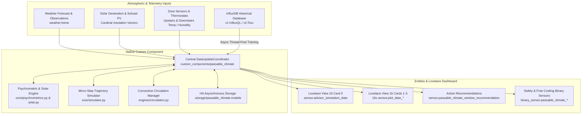
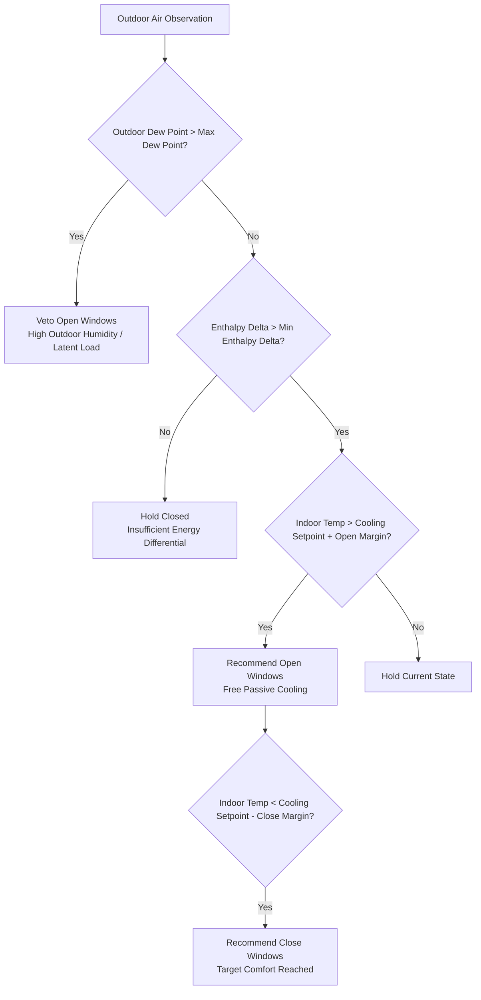
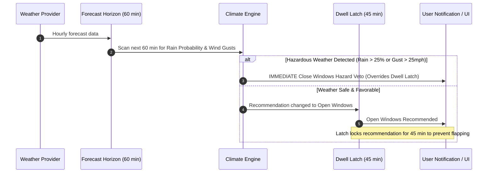
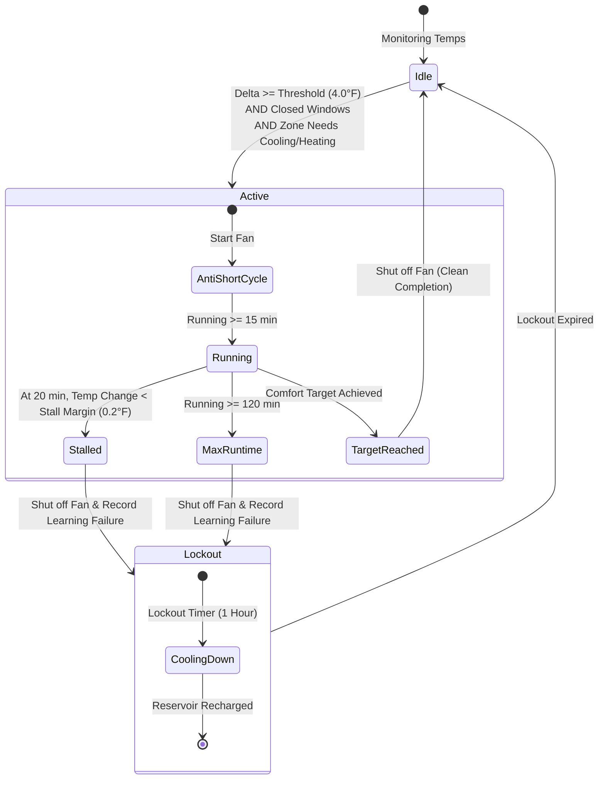

# 🌡️ Passable Smart Climate Engine

[](https://github.com/hacs/default)
[](https://github.com/GBear09/passable-smart-climate-engine/releases)
[](LICENSE)

An intelligent thermodynamic building modeling, psychrometric natural ventilation advisor, and convective HVAC circulation engine for Home Assistant. Runs natively on Home Assistant Core's asynchronous engine with full HACS 1-click install and update support.

Configure zones and atmospheric inputs seamlessly using the **Native UI Config Flow** (with zero manual YAML required), while preserving 100% backward compatibility with existing Lovelace dashboards and trigger automations!

---

## ⚙️ Key Features

- **🌬️ ASHRAE Moist Air Specific Enthalpy ($h$):** Calculates true total heat content (BTU/lb) and saturation vapor pressure via the Arden Buck equation rather than relying solely on dry-bulb temperature, preventing indoor moisture loading and latent cooling penalties.
- **⏱️ 10-Minute Dual-Zone Micro-Simulation:** Projects indoor temperature and humidity trajectories 12–24 hours forward in 10-minute micro-steps across Upstairs and Downstairs zones to evaluate thermal momentum and future comfort bounds.
- **🛡️ Anti-Flapping & Predictive Horizon:** Enforces a 60-minute sustained forecast favorability lookahead and a 45-minute minimum dwell latch to prevent rapid cycling and notification fatigue.
- **☀️ Cardinal Facade Solar Decomposition:** Computes direct and diffuse solar irradiance split into non-negative cardinal facade vectors ($I_{south}, I_{east}, I_{west}$) aligned with Solcast PV forecast curves.
- **🤖 Thread-Safe In-Memory Machine Learning:** Automatically trains RANSAC robust 2D slope/intercept models and Ridge Multiple Linear Regression (MLR) models with alpha cross-validation from historical InfluxDB data inside thread-pool executors.
- **🌀 Convective Thermal Circulation Manager:** Leverages attic and basement temperature differentials to naturally cool or heat living spaces, protected by anti-stall detection and an exponential-distance machine learning feedback loop.
- **🚫 Multi-Tier Weather Hazard Vetoes:** Instant safety gates for precipitation probability, high sustained wind ($>18\text{ mph}$), wind gusts ($>25\text{ mph}$), and elevated AQI ($>50$).
- **📊 100% Lovelace Dashboard Compatibility:** Automatically registers the canonical 16 `sensor.plot_data_*` entities and `sensor.advisor_simulation_data` with exact attribute schemas, powering existing scatter plots, radar charts, and forward trajectory graphs with zero dashboard edits.

---

## 📂 Architecture: Dual-Zone Thermodynamics & Forward Simulation



---

## 🚀 Installation via HACS

1. Open **HACS** in your Home Assistant instance.
2. Click the three dots in the top right corner and select **Custom repositories**.
3. Add repository URL:
   ```text
   https://github.com/GBear09/passable-smart-climate-engine
   ```
4. Select **Type:** `Integration`.
5. Click **Add**, find **Passable Smart Climate Engine**, and click **Download**.
6. Restart Home Assistant.

---

## 🛠️ Configuration

### Option A: Native UI Config Flow (4 Easy Steps)

1. Go to **Settings → Devices & Services → Add Integration**.
2. Search for **Passable Smart Climate Engine**.
3. **Step 1: Environmental & Atmospheric Entities**
   - **Weather Provider:** Primary weather entity (e.g. `weather.home`).
   - **Solar Generation:** Live solar production and Solcast forecast power sensors.
   - **Occupancy & Home Mode:** `input_select.home_mode` and `binary_sensor.someone_is_home`.
   - **AQI Sensor (Optional):** Outdoor Air Quality Index sensor for smoke/particulate vetoes.
4. **Step 2: InfluxDB Connection (with Pre-Flight Connection Test)**
   - Enter your InfluxDB host, port, database/bucket, and credentials (masked password or v2 token).
   - The integration automatically runs a connection test before proceeding to prevent setup errors.
5. **Step 3: Dual-Zone Climate & Circulation Mapping**
   - Configure Upstairs & Downstairs thermostats (`climate.*`), average temperature/humidity sensors, and open window count sensors.
   - Enable attic/basement convective circulation fans and assign indicator helpers.
6. **Step 4: Schedules & Target Output Helpers**
   - Map bedtime datetime helpers (`input_datetime.max_s_bedtime`, `parent_bedtime`).
   - Assign output helpers (e.g. `input_text.comfort_profile_overview`, `input_boolean.hvac_advisor_predicts_heat_needed`).
7. Click **Submit**. The integration provisions the Hub and Zone devices!

### Option B: Blue/Green Safe Cutover (Zero Risk Transition)

You do not need to delete or alter your existing Pyscript files:
1. Complete the UI setup above.
2. In **Settings → Automations & Scenes**, toggle **OFF** your legacy Pyscript runner automations.
3. The native integration takes over, updating `input_text.comfort_profile_overview` and the exact 16 `sensor.plot_data_*` entities.
4. If you ever need to roll back, simply disable the integration entry and toggle the automations back on.

---

## 🎛️ Entities Created & Dashboard Integration

### Core Advisory & Diagnostic Entities

| Entity ID | Domain | Description |
| :--- | :--- | :--- |
| `sensor.passable_climate_window_recommendation` | `sensor` | Current advisory state (`Open Windows` / `Close Windows`) with Markdown plan attribute. |
| `sensor.advisor_simulation_data` | `sensor` | Trajectory JSON attribute powering **Lovelace Comfort View Card 0**. |
| `sensor.outdoor_specific_enthalpy` | `sensor` | Real-time outdoor moist air enthalpy ($h$, BTU/lb). |
| `sensor.upstairs_enthalpy_delta` | `sensor` | Indoor vs outdoor enthalpy differential for Upstairs. |
| `sensor.downstairs_enthalpy_delta` | `sensor` | Indoor vs outdoor enthalpy differential for Downstairs. |
| `binary_sensor.passable_climate_weather_hazard_veto` | `binary_sensor` | Active safety veto (rain probability, high wind speed/gust, AQI). |
| `binary_sensor.passable_climate_upstairs_free_cooling` | `binary_sensor` | Indicates whether free passive conditioning is advantageous Upstairs. |
| `binary_sensor.passable_climate_downstairs_free_cooling` | `binary_sensor` | Indicates whether free passive conditioning is advantageous Downstairs. |
| `button.passable_climate_refresh_window_recommendation` | `button` | 1-click button to immediately force advisor re-evaluation and simulation update. |
| `button.passable_climate_retrain_thermal_models` | `button` | 1-click button to trigger background InfluxDB regression retraining. |


### The 16 Canonical Plot Data Sensors (`sensor.plot_data_*`)

All 16 entities maintain 100% attribute compatibility with Lovelace View 16 ("Comfort"):

| Series Entity ID | Metric Type | State | Supported Card Attributes |
| :--- | :--- | :--- | :--- |
| `sensor.plot_data_upstairs_temp_profile_win_closed` | Temp Closed | Inlier Count | `x_data`, `y_data`, `fit_x`, `fit_y`, `equation`, `c_delta_t`, `norm_c_*` |
| `sensor.plot_data_upstairs_temp_profile_win_open` | Temp Open | Inlier Count | `x_data`, `y_data`, `fit_x`, `fit_y`, `equation`, `c_delta_t`, `norm_c_*` |
| `sensor.plot_data_upstairs_temp_profile_hvac_heat` | Temp HVAC Heat | Inlier Count | `x_data`, `y_data`, `fit_x`, `fit_y`, `equation`, `c_delta_t`, `norm_c_*` |
| `sensor.plot_data_upstairs_temp_profile_hvac_cool` | Temp HVAC Cool | Inlier Count | `x_data`, `y_data`, `fit_x`, `fit_y`, `equation`, `c_delta_t`, `norm_c_*` |
| `sensor.plot_data_upstairs_humidity_profile_win_closed` | Humidity Closed | Inlier Count | `x_data`, `y_data`, `fit_x`, `fit_y`, `equation`, `c_delta_t`, `norm_c_*` |
| `sensor.plot_data_upstairs_humidity_profile_win_open` | Humidity Open | Inlier Count | `x_data`, `y_data`, `fit_x`, `fit_y`, `equation`, `c_delta_t`, `norm_c_*` |
| `sensor.plot_data_upstairs_humidity_profile_hvac_heat` | Humidity HVAC Heat | Inlier Count | `x_data`, `y_data`, `fit_x`, `fit_y`, `equation`, `c_delta_t`, `norm_c_*` |
| `sensor.plot_data_upstairs_humidity_profile_hvac_cool` | Humidity HVAC Cool | Inlier Count | `x_data`, `y_data`, `fit_x`, `fit_y`, `equation`, `c_delta_t`, `norm_c_*` |
| *(+ 8 matching downstairs sensors)* | ... | ... | ... |

---

## 🎛️ Live Tuning & Options Reference

Passable Smart Climate Engine features a native **Options Flow** accessible anytime without restarting Home Assistant or editing YAML files.

To access live tuning:
1. Navigate to **Settings → Devices & Services**.
2. Locate **Passable Smart Climate Engine** and click the **Configure (Gear Icon)**.
3. Select any of the three categorized tuning submenus:

```text
Passable Smart Climate Tuning
├── 1. Thermodynamic & Enthalpy Deadbands
├── 2. Hazard Safety & Dwell Limits
└── 3. Convective Circulation Guardrails
```

Every parameter includes in-line subtext descriptions directly in the Home Assistant UI, explaining its purpose and the effect of adjusting it higher or lower.

---

### 1. Thermodynamic & Enthalpy Deadbands

Controls when natural ventilation is thermodynamically viable based on moist air psychrometrics (sensible and latent heat) rather than simple dry-bulb temperature.



| Parameter | Default | Range | What It Does & Engineering Rationale | Setting Higher ($\uparrow$) | Setting Lower ($\downarrow$) |
| :--- | :---: | :---: | :--- | :--- | :--- |
| **Minimum Enthalpy Advantage**<br/>`min_enthalpy_delta` | `1.2 BTU/lb` | 0.5 – 3.0 | Total energy advantage (accounting for both dry air temperature and moisture content) required before recommending open windows. Derived from ASHRAE moist air psychrometrics. | **More conservative.** Only recommends opening windows when outdoor air is drastically cooler and drier. Prevents opening in marginal conditions. | **More aggressive.** Recommends opening windows with smaller cooling/enthalpy differentials, maximizing the number of open-window hours. |
| **Maximum Outdoor Dew Point**<br/>`max_dew_point` | `58.0 °F` | 45.0 – 65.0 | Absolute ceiling on outdoor moisture content allowed for natural ventilation, regardless of temperature. Prevents interior clamminess and heavy latent loads on subsequent AC cooling. | **Permissive.** Allows ventilation during muggy evenings (60–65°F), but risks elevating indoor relative humidity and causing sticky indoor air. | **Strict.** Enforces dry, crisp indoor air (50–55°F dew point). Shuts windows earlier on humid spring and summer evenings. |
| **Open Window Target Margin**<br/>`open_temp_margin` | `1.0 °F` | 0.5 – 3.0 | Temperature threshold above the active comfort cooling setpoint before an open-window recommendation triggers. | **Delayed opening.** Waits until the living space drifts further above the thermostat setpoint before prompting. Prevents premature opening. | **Early opening.** Prompts to open windows as soon as the indoor temperature begins to creep upward, catching early cool breezes. |
| **Close Window Hysteresis Margin**<br/>`close_temp_margin` | `0.2 °F` | 0.0 – 1.0 | Deadband below the target comfort setpoint before calling to close windows. | **Deeper subcooling.** Allows rooms to intentionally overcool by a degree or more, charging interior thermal mass with free coolness for the next day. | **Strict comfort.** Calls to close windows immediately once the thermostat setpoint is reached, strictly preventing chilly indoor drafts. |

---

### 2. Hazard Safety & Dwell Limits

Guards your home against sudden rain squalls, high winds, and rapid recommendation oscillation ("flapping").



| Parameter | Default | Range | What It Does & Engineering Rationale | Setting Higher ($\uparrow$) | Setting Lower ($\downarrow$) |
| :--- | :---: | :---: | :--- | :--- | :--- |
| **Minimum Window Open Dwell Duration**<br/>`open_dwell_minutes` | `45 min` | 15 – 120 | Anti-flapping latch duration. Once windows are recommended open, the recommendation remains latched for at least this duration before it can revert to close (unless an emergency hazard occurs). | **Maximum stability.** Prevents notification fatigue and frequent trips to open/close windows during fluctuating outdoor conditions. | **High responsiveness.** Integration tracks rapid ambient fluctuations quickly, but may cause frequent open/close cycles on unstable days. |
| **Hazard Forecast Lookahead Window**<br/>`forecast_lookahead_minutes` | `60 min` | 30 – 180 | Predictive lookahead window across hourly forecast entries to intercept approaching rain fronts, sudden wind gusts, or severe temperature spikes before they arrive. | **Predictive protection.** Looks 90–180 minutes ahead. Won't recommend opening windows if a thunderstorm or cold front is arriving later that afternoon. | **Short-term horizon.** Only evaluates weather in the immediate 30–45 minutes, taking advantage of brief fair-weather windows. |
| **High Sustained Wind Speed Limit**<br/>`high_wind_speed` | `18.0 mph` | 10.0 – 30.0 | Sustained wind speed threshold that triggers an automatic hazard veto to close windows. Protects window hardware, screens, and indoor furnishings from wind damage. | **Allows breezy ventilation.** Windows can stay open in gustier conditions (20–25 mph). Papers or curtains may blow around. | **Calm conditions only.** Closes windows in mild breezes (12–15 mph), prioritizing indoor stillness. |
| **High Wind Gust Limit**<br/>`high_wind_gust` | `25.0 mph` | 15.0 – 45.0 | Peak instantaneous wind gust threshold that triggers an immediate safety veto. | **Tolerates gusts.** Allows windows to remain open through occasional brisk gusts (30–35 mph). | **Immediate gust closure.** Vetoes window opening on any sudden bluster (18–20 mph). |
| **Maximum Precipitation Probability**<br/>`max_precipitation_probability` | `25.0 %` | 10.0 – 50.0 | Forecast rain probability that triggers an automatic hazard veto. | **Tolerates slight rain risk.** Windows stay open even if there is a 30–40% chance of isolated sprinkles. | **Zero-tolerance rain gate.** Closes windows if the forecast indicates even a 10–15% slight chance of rain, guaranteeing dry interiors. |

---

### 3. Convective Circulation Guardrails

Governs the autonomous redistribution of natural thermal reservoirs (attic air in heating mode, basement earth-cooled air in cooling mode) via the central HVAC blower fan.



| Parameter | Default | Range | What It Does & Engineering Rationale | Setting Higher ($\uparrow$) | Setting Lower ($\downarrow$) |
| :--- | :---: | :---: | :--- | :--- | :--- |
| **Enable Upstairs Convective Circulation**<br/>`upstairs_circ_enabled` | `false` | bool | Master toggle for Upstairs circulation. Automatically activates the HVAC fan when attic or upper-plenum air offers an advantageous thermal split while windows are closed. | **Enabled.** Fully automates fan circulation for the upstairs zone. | **Disabled.** Completely deactivates upstairs automated circulation management. |
| **Enable Downstairs Convective Circulation**<br/>`downstairs_circ_enabled` | `false` | bool | Master toggle for Downstairs circulation. Automatically activates the HVAC fan when basement earth-cooled air can assist with cooling living spaces. | **Enabled.** Fully automates fan circulation for the downstairs zone. | **Disabled.** Completely deactivates downstairs automated circulation management. |
| **Minimum Temperature Differential**<br/>`circulation_delta_threshold` | `4.0 °F` | 2.0 – 8.0 | Minimum temperature difference between the living area and the thermal reservoir (attic or basement) required before the circulation fan will turn on. | **High efficiency per watt.** Runs the fan only when there is a large temperature delta (5–6°F), ensuring rapid thermal transfer and high COP. | **Frequent circulation.** Runs fan with smaller temperature splits (2.5–3°F), redistributing air more frequently. |
| **Minimum Run Time**<br/>`circulation_min_minutes` | `15 min` | 10 – 30 | Anti-short-cycle motor guard. Once the circulation fan starts, it is guaranteed to run for at least this long before stopping (unless windows are manually opened). | **Equipment protection.** Prevents HVAC blower and relay wear caused by rapid on/off cycling. | **Quick shutoff.** Allows the system to turn off fan sooner if thermal conditions equalize quickly. |
| **Maximum Run Time**<br/>`circulation_max_minutes` | `120 min` | 60 – 240 | Maximum continuous run time allowed for a single circulation cycle to prevent continuous fan operation after thermal reservoirs equalize. | **Extended circulation.** Allows long continuous circulation cycles during prolonged thermal extremes. | **Conserves power.** Caps circulation cycles to shorter intervals (60–90 min) to conserve blower electrical power. |
| **Stall Detection Margin**<br/>`circulation_stall_margin` | `0.2 °F` | 0.1 – 0.5 | Machine-learning thermal progress verification. At 20 minutes into a run, the actual zone temperature trajectory is compared to building physics models. If temperature change lags by more than this margin, the run is aborted as "stalled". | **Strict stall cutoff.** Quickly shuts down fan and enters lockout if heat transfer is sluggish. | **Forgiving.** Gives the circulation fan more time to move heavy furniture and drywall thermal mass before declaring a stall. |
| **Post-Stall Lockout Duration**<br/>`circulation_lockout_hours` | `1 hour` | 1 – 6 | Cooldown lockout period enforced after a stalled run or maximum runtime expiration before another circulation attempt is permitted, allowing thermal reservoirs to naturally recharge. | **Deep reservoir recharge.** Gives the basement or attic several hours to re-stratify and regain thermal advantage. | **Frequent re-testing.** Retries circulation sooner (1 hour) to check if conditions have improved. |

---

## 🔄 Services

### `passable_climate.retrain_models`
Triggers an immediate asynchronous InfluxDB query and regression retraining of all 16 zone thermodynamic models in a background thread.

```yaml
service: passable_climate.retrain_models
```

### `passable_climate.refresh_plan`
Forces an immediate re-evaluation and forward micro-step simulation of window recommendations and circulation status.

```yaml
service: passable_climate.refresh_plan
```

---

## 📦 Automatic Model Caching & Persistence

Trained models and circulation machine learning weights are automatically cached in Home Assistant's native storage (`.storage/`):
- `.storage/passable_climate.models`: Fitted slopes, intercepts, equations, and standardized MLR coefficients.
- `.storage/passable_climate.learning_data`: Historical convective circulation run records and success rates.

On restart, cached models load instantly with zero delay, and scheduled retraining refreshes models seamlessly in the background.

---

## 📄 License

Distributed under the [MIT License](LICENSE).
