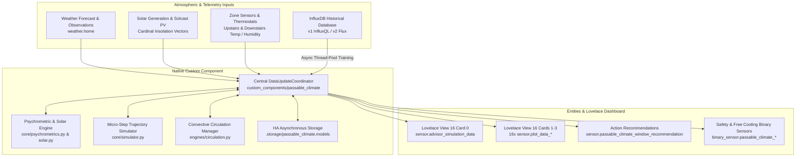

# 🌡️ Passable Smart Climate Engine

[](https://github.com/hacs/default)
[](https://github.com/GBear09/passable-smart-climate-engine/releases)
[](LICENSE)

An intelligent thermodynamic building modeling, psychrometric natural ventilation advisor, and convective HVAC circulation engine for Home Assistant. Runs natively on Home Assistant Core's asynchronous engine with full HACS 1-click install and update support.

Configure zones and atmospheric inputs seamlessly using the **Native UI Config Flow** (with zero manual YAML required), while preserving 100% backward compatibility with existing Lovelace dashboards and trigger automations!

---

## ⚙️ Key Features

- **🌬️ ASHRAE Moist Air Specific Enthalpy ($h$):** Calculates true total heat content (BTU/lb) and saturation vapor pressure via the Arden Buck equation rather than relying solely on dry-bulb temperature, preventing indoor moisture loading and latent cooling penalties.
- **⏱️ 10-Minute Dual-Zone Micro-Simulation:** Projects indoor temperature and humidity trajectories 12–24 hours forward in 10-minute micro-steps across Upstairs and Downstairs zones to evaluate thermal momentum and future comfort bounds.
- **🛡️ Anti-Flapping & Predictive Horizon:** Enforces a 60-minute sustained forecast favorability lookahead and a 45-minute minimum dwell latch to prevent rapid cycling and notification fatigue.
- **☀️ Cardinal Facade Solar Decomposition:** Computes direct and diffuse solar irradiance split into non-negative cardinal facade vectors ($I_{south}, I_{east}, I_{west}$) aligned with Solcast PV forecast curves.
- **🤖 Thread-Safe In-Memory Machine Learning:** Automatically trains RANSAC robust 2D slope/intercept models and Ridge Multiple Linear Regression (MLR) models with alpha cross-validation from historical InfluxDB data inside thread-pool executors.
- **🌀 Convective Thermal Circulation Manager:** Leverages attic and basement temperature differentials to naturally cool or heat living spaces, protected by anti-stall detection and an exponential-distance machine learning feedback loop.
- **🚫 Multi-Tier Hazard & Occupancy Vetoes:** Instant safety gates for precipitation probability, high sustained wind ($>18\text{ mph}$), wind gusts ($>25\text{ mph}$), elevated AQI ($>50$), and unoccupied/Away states.
- **📊 100% Lovelace Dashboard Compatibility:** Automatically registers the canonical 16 `sensor.plot_data_*` entities and `sensor.advisor_simulation_data` with exact attribute schemas, powering existing scatter plots, radar charts, and forward trajectory graphs with zero dashboard edits.

---

## 📂 Architecture: Dual-Zone Thermodynamics & Forward Simulation



---

## 🚀 Installation via HACS

1. Open **HACS** in your Home Assistant instance.
2. Click the three dots in the top right corner and select **Custom repositories**.
3. Add repository URL:
   ```text
   https://github.com/GBear09/passable-smart-climate-engine
   ```
4. Select **Type:** `Integration`.
5. Click **Add**, find **Passable Smart Climate Engine**, and click **Download**.
6. Restart Home Assistant.

---

## 🛠️ Configuration

### Option A: Native UI Config Flow (4 Easy Steps)

1. Go to **Settings → Devices & Services → Add Integration**.
2. Search for **Passable Smart Climate Engine**.
3. **Step 1: Environmental & Atmospheric Entities**
   - **Weather Provider:** Primary weather entity (e.g. `weather.home`).
   - **Solar Generation:** Live solar production and Solcast forecast power sensors.
   - **Occupancy & Home Mode:** `input_select.home_mode` and `binary_sensor.someone_is_home`.
   - **AQI Sensor (Optional):** Outdoor Air Quality Index sensor for smoke/particulate vetoes.
4. **Step 2: InfluxDB Connection (with Pre-Flight Connection Test)**
   - Enter your InfluxDB host, port, database/bucket, and credentials (masked password or v2 token).
   - The integration automatically runs a connection test before proceeding to prevent setup errors.
5. **Step 3: Dual-Zone Climate & Circulation Mapping**
   - Configure Upstairs & Downstairs thermostats (`climate.*`), average temperature/humidity sensors, and open window count sensors.
   - Enable attic/basement convective circulation fans and assign indicator helpers.
6. **Step 4: Schedules & Target Output Helpers**
   - Map bedtime datetime helpers (`input_datetime.max_s_bedtime`, `parent_bedtime`).
   - Assign output helpers (e.g. `input_text.comfort_profile_overview`, `input_boolean.hvac_advisor_predicts_heat_needed`).
7. Click **Submit**. The integration provisions the Hub and Zone devices!

### Option B: Blue/Green Safe Cutover (Zero Risk Transition)

You do not need to delete or alter your existing Pyscript files:
1. Complete the UI setup above.
2. In **Settings → Automations & Scenes**, toggle **OFF** your legacy Pyscript runner automations.
3. The native integration takes over, updating `input_text.comfort_profile_overview` and the exact 16 `sensor.plot_data_*` entities.
4. If you ever need to roll back, simply disable the integration entry and toggle the automations back on.

---

## 🎛️ Entities Created & Dashboard Integration

### Core Advisory & Diagnostic Entities

| Entity ID | Domain | Description |
| :--- | :--- | :--- |
| `sensor.passable_climate_window_recommendation` | `sensor` | Current advisory state (`Open Windows` / `Close Windows`) with Markdown plan attribute. |
| `sensor.advisor_simulation_data` | `sensor` | Trajectory JSON attribute powering **Lovelace Comfort View Card 0**. |
| `sensor.outdoor_specific_enthalpy` | `sensor` | Real-time outdoor moist air enthalpy ($h$, BTU/lb). |
| `sensor.upstairs_enthalpy_delta` | `sensor` | Indoor vs outdoor enthalpy differential for Upstairs. |
| `sensor.downstairs_enthalpy_delta` | `sensor` | Indoor vs outdoor enthalpy differential for Downstairs. |
| `binary_sensor.passable_climate_weather_hazard_veto` | `binary_sensor` | Active safety veto (rain probability, high wind speed/gust, AQI). |
| `binary_sensor.passable_climate_upstairs_free_cooling` | `binary_sensor` | Indicates whether free passive conditioning is advantageous Upstairs. |
| `binary_sensor.passable_climate_downstairs_free_cooling` | `binary_sensor` | Indicates whether free passive conditioning is advantageous Downstairs. |
| `button.passable_climate_retrain_thermal_models` | `button` | 1-click button to trigger background InfluxDB regression retraining. |

### The 16 Canonical Plot Data Sensors (`sensor.plot_data_*`)

All 16 entities maintain 100% attribute compatibility with Lovelace View 16 ("Comfort"):

| Series Entity ID | Metric Type | State | Supported Card Attributes |
| :--- | :--- | :--- | :--- |
| `sensor.plot_data_upstairs_temp_profile_win_closed` | Temp Closed | Inlier Count | `x_data`, `y_data`, `fit_x`, `fit_y`, `equation`, `c_delta_t`, `norm_c_*` |
| `sensor.plot_data_upstairs_temp_profile_win_open` | Temp Open | Inlier Count | `x_data`, `y_data`, `fit_x`, `fit_y`, `equation`, `c_delta_t`, `norm_c_*` |
| `sensor.plot_data_upstairs_temp_profile_hvac_heat` | Temp HVAC Heat | Inlier Count | `x_data`, `y_data`, `fit_x`, `fit_y`, `equation`, `c_delta_t`, `norm_c_*` |
| `sensor.plot_data_upstairs_temp_profile_hvac_cool` | Temp HVAC Cool | Inlier Count | `x_data`, `y_data`, `fit_x`, `fit_y`, `equation`, `c_delta_t`, `norm_c_*` |
| `sensor.plot_data_upstairs_humidity_profile_win_closed` | Humidity Closed | Inlier Count | `x_data`, `y_data`, `fit_x`, `fit_y`, `equation`, `c_delta_t`, `norm_c_*` |
| `sensor.plot_data_upstairs_humidity_profile_win_open` | Humidity Open | Inlier Count | `x_data`, `y_data`, `fit_x`, `fit_y`, `equation`, `c_delta_t`, `norm_c_*` |
| `sensor.plot_data_upstairs_humidity_profile_hvac_heat` | Humidity HVAC Heat | Inlier Count | `x_data`, `y_data`, `fit_x`, `fit_y`, `equation`, `c_delta_t`, `norm_c_*` |
| `sensor.plot_data_upstairs_humidity_profile_hvac_cool` | Humidity HVAC Cool | Inlier Count | `x_data`, `y_data`, `fit_x`, `fit_y`, `equation`, `c_delta_t`, `norm_c_*` |
| *(+ 8 matching downstairs sensors)* | ... | ... | ... |

---

## 🔄 Services

### `passable_climate.retrain_models`
Triggers an immediate asynchronous InfluxDB query and regression retraining of all 16 zone thermodynamic models in a background thread.

```yaml
service: passable_climate.retrain_models
```

### `passable_climate.refresh_plan`
Forces an immediate re-evaluation and forward micro-step simulation of window recommendations and circulation status.

```yaml
service: passable_climate.refresh_plan
```

---

## 📦 Automatic Model Caching & Persistence

Trained models and circulation machine learning weights are automatically cached in Home Assistant's native storage (`.storage/`):
- `.storage/passable_climate.models`: Fitted slopes, intercepts, equations, and standardized MLR coefficients.
- `.storage/passable_climate.learning_data`: Historical convective circulation run records and success rates.

On restart, cached models load instantly with zero delay, and scheduled retraining refreshes models seamlessly in the background.

---

## 📄 License

Distributed under the [MIT License](LICENSE).
